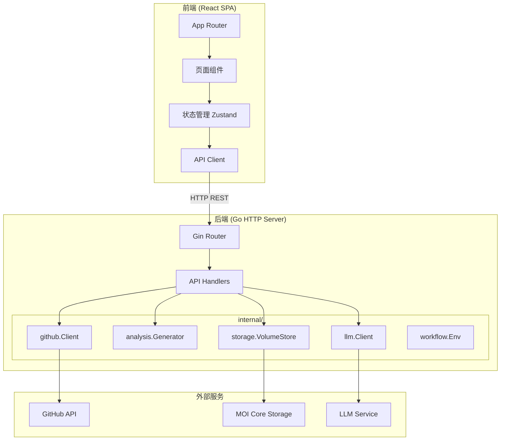
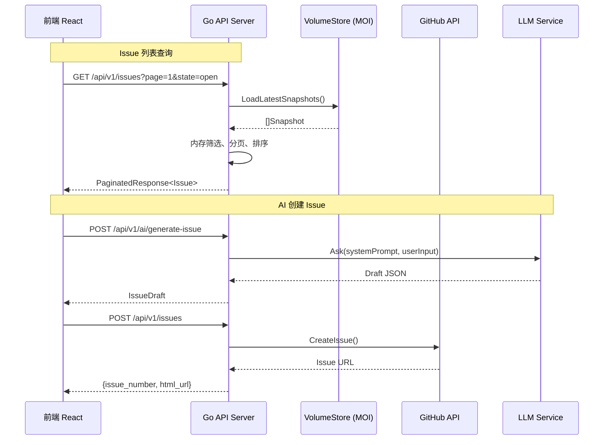

# 设计文档：Frontend Dashboard

## 概述

为 GitHub Issue 智能管理系统构建一个前端 Dashboard Web 应用，提供数据可视化、Issue 管理、分析报告查看、工作流触发和知识库浏览等核心能力。系统采用前后端分离架构：前端使用 React + TypeScript 构建 SPA 应用，后端在现有 Go 服务中新增 HTTP API 层，复用已有的 `internal/` 包（storage、analysis、github、llm、workflow 等）。

### 设计目标

- 复用现有 Go 后端能力，避免重复实现业务逻辑
- 前端提供响应式布局，支持桌面和移动端
- API 设计遵循 RESTful 规范，返回 JSON 格式数据
- 支持多仓库切换（matrixone、matrixflow 等）

## 架构

### 整体架构



### 技术栈

| 层级 | 技术选型 | 说明 |
|------|---------|------|
| 前端框架 | React 18 + TypeScript | 成熟生态，类型安全 |
| 构建工具 | Vite | 快速开发体验 |
| UI 组件库 | Ant Design 5 | 企业级组件，内置中文支持 |
| 图表库 | ECharts (via echarts-for-react) | 丰富的图表类型，适合数据可视化 |
| 状态管理 | Zustand | 轻量、简洁，适合中等规模应用 |
| 路由 | React Router v6 | SPA 路由管理 |
| HTTP 客户端 | Axios | 请求拦截、错误处理 |
| Markdown 渲染 | react-markdown + remark-gfm | Issue 正文和报告渲染 |
| 后端框架 | Gin | Go 高性能 HTTP 框架 |
| 后端存储 | 复用 VolumeStore (MOI Core) | 已有的数据存储层 |

### 目录结构

```
frontend/                          # 前端项目根目录
├── src/
│   ├── api/                       # API 请求封装
│   │   ├── client.ts              # Axios 实例与拦截器
│   │   ├── issues.ts              # Issue 相关 API
│   │   ├── reports.ts             # 报告相关 API
│   │   ├── workflows.ts           # 工作流相关 API
│   │   └── knowledge.ts           # 知识库相关 API
│   ├── components/                # 通用组件
│   │   ├── Layout.tsx             # 侧边栏 + 顶栏布局
│   │   └── ErrorBoundary.tsx      # 错误边界
│   ├── pages/                     # 页面组件
│   │   ├── Dashboard.tsx          # 总览页
│   │   ├── IssueList.tsx          # Issue 列表页
│   │   ├── IssueDetail.tsx        # Issue 详情页
│   │   ├── KanbanBoard.tsx        # 看板页
│   │   ├── IssueCreator.tsx       # 创建 Issue 页
│   │   ├── ReportList.tsx         # 报告列表页
│   │   ├── ReportDetail.tsx       # 报告详情页
│   │   ├── WorkflowManager.tsx    # 工作流管理页
│   │   └── KnowledgeBase.tsx      # 知识库页
│   ├── stores/                    # Zustand 状态
│   │   └── appStore.ts            # 全局状态（当前仓库等）
│   ├── types/                     # TypeScript 类型定义
│   │   └── index.ts
│   ├── App.tsx
│   └── main.tsx
├── index.html
├── package.json
├── tsconfig.json
└── vite.config.ts

go/
├── cmd/
│   ├── api-server/                # 新增：API 服务入口
│   │   └── main.go
│   ├── issuectl/
│   └── issue-worker/
├── internal/
│   ├── api/                       # 新增：HTTP API 层
│   │   ├── router.go              # 路由注册
│   │   ├── middleware.go           # CORS、错误处理中间件
│   │   ├── issues.go              # Issue 相关 handler
│   │   ├── reports.go             # 报告相关 handler
│   │   ├── workflows.go           # 工作流相关 handler
│   │   ├── knowledge.go           # 知识库相关 handler
│   │   └── ai.go                  # AI Issue 生成 handler
│   ├── analysis/
│   ├── github/
│   ├── llm/
│   ├── storage/
│   └── workflow/
```

## 组件与接口

### 前端组件设计

#### 1. Layout 组件（需求 9）

全局布局组件，包含侧边栏导航和顶部栏。

```typescript
// Layout.tsx
interface LayoutProps {
  children: React.ReactNode;
}
// 侧边栏导航项：总览、Issue 列表、看板、创建 Issue、分析报告、工作流管理、知识库
// 顶部栏：当前仓库名称、仓库切换下拉框
// 响应式：屏幕宽度 < 768px 时侧边栏折叠为汉堡菜单
```

#### 2. Dashboard 总览页（需求 1）

```typescript
// Dashboard.tsx
// 统计卡片区：Issue 总数、Open 数量、Closed 数量、Open 占比
// 图表区：按 Labels 前缀（kind/、area/、customer/）分组的饼图/柱状图
// 最近更新列表：最近 7 天更新的 Issue（最多 20 条）
// 健康度摘要：各客户项目健康度评分卡片
```

#### 3. IssueList 页（需求 2）

```typescript
// IssueList.tsx
interface IssueListParams {
  page: number;
  pageSize: number;
  state?: string;
  labels?: string[];
  assignee?: string;
  startDate?: string;
  endDate?: string;
  keyword?: string;
  sortField?: string;
  sortOrder?: 'asc' | 'desc';
}
// Ant Design Table 分页表格，列：编号、标题、状态、Labels（Tag 组件）、负责人、更新时间
// Filter_Panel：状态下拉、Labels 多选、负责人下拉、时间范围选择器
// 搜索框：关键词搜索（标题 + 正文）
// 点击行跳转 IssueDetail
```

#### 4. IssueDetail 页（需求 2.5）

```typescript
// IssueDetail.tsx
// Markdown 渲染 Issue 正文
// Labels 展示为 Tag 组件
// 负责人、时间线、评论列表
```

#### 5. KanbanBoard 页（需求 3）

```typescript
// KanbanBoard.tsx
// 四列看板：待处理、进行中、已完成、已关闭
// 每列展示 Issue 卡片（标题、负责人、优先级标识、进度百分比）
// 顶部筛选：project/ 标签下拉、customer/ 标签下拉
// 顶部统计：完成率、平均进度
```

#### 6. IssueCreator 页（需求 4）

```typescript
// IssueCreator.tsx
// 文字输入区：TextArea 输入问题描述
// 图片上传：Upload 组件，支持拖拽上传
// 提交按钮 → 调用 AI 生成接口 → 展示加载状态
// 预览表单：可编辑的标题、正文（Markdown 编辑器）、Labels（多选）、负责人（下拉）
// 确认创建按钮 → 调用创建接口 → 展示成功链接
```

#### 7. ReportList / ReportDetail 页（需求 5）

```typescript
// ReportList.tsx
// 报告列表表格：报告类型、生成时间、仓库名称
// 点击进入 ReportDetail

// ReportDetail.tsx
// 根据报告类型渲染不同结构：
// - 项目推进分析：健康度评分、层级统计表格、堵塞点列表、AI 建议
// - 横向关联分析：共用 Feature 列表、高 Bug Feature 列表、AI 战略建议
// - 可扩展分析：基础统计、标签分析
// Issue 编号可点击跳转到 IssueDetail
```

#### 8. WorkflowManager 页（需求 6）

```typescript
// WorkflowManager.tsx
interface WorkflowDef {
  id: string;           // WF-001 ~ WF-007
  name: string;
  description: string;
  implemented: boolean;
  params: WorkflowParam[];
}
interface WorkflowParam {
  name: string;
  label: string;
  required: boolean;
  type: 'string' | 'boolean';
}
// 工作流卡片列表，每个卡片展示名称、描述、实现状态
// 点击展开参数表单（repo_owner、repo_name 等）
// 触发按钮 → 调用触发接口 → 展示执行状态（排队中/执行中/已完成/失败）
// 执行中时禁用触发按钮
// 完成后展示结果摘要
```

#### 9. KnowledgeBase 页（需求 7）

```typescript
// KnowledgeBase.tsx
// 三个板块 Tab：产品结构、标签体系、常见 Issue 类型
// Markdown 渲染知识库内容
// 产品/模块可点击 → 跳转到 IssueList 并按该标签筛选
// 标签可点击 → 跳转到 IssueList 并按该标签筛选
// 展示生成时间和版本信息
```

### 后端 API 接口设计（需求 8）

#### 路由总览

| 方法 | 路径 | 说明 | 对应需求 |
|------|------|------|---------|
| GET | `/api/v1/issues` | Issue 列表查询 | 8.1 |
| GET | `/api/v1/issues/:number` | Issue 详情 | 8.2 |
| GET | `/api/v1/stats/overview` | Dashboard 统计数据 | 1.1-1.4 |
| GET | `/api/v1/stats/labels` | Labels 分布统计 | 1.2 |
| GET | `/api/v1/reports` | 报告列表 | 8.3 |
| GET | `/api/v1/reports/:id` | 报告详情 | 8.3 |
| GET | `/api/v1/workflows` | 工作流列表 | 6.1 |
| POST | `/api/v1/workflows/:id/trigger` | 触发工作流 | 8.4 |
| GET | `/api/v1/workflows/:id/status` | 工作流执行状态 | 6.3 |
| GET | `/api/v1/knowledge` | 知识库数据 | 8.5 |
| POST | `/api/v1/ai/generate-issue` | AI 生成 Issue 预览 | 8.6 |
| POST | `/api/v1/issues` | 创建 Issue 到 GitHub | 8.7 |
| GET | `/api/v1/repos` | 可用仓库列表 | 9.5 |

#### 接口详细定义

**GET /api/v1/issues**

```
Query Parameters:
  page        int     默认 1
  page_size   int     默认 20，最大 100
  state       string  open | closed | all
  labels      string  逗号分隔的标签列表
  assignee    string  负责人 GitHub 用户名
  start_date  string  ISO 8601 格式
  end_date    string  ISO 8601 格式
  keyword     string  搜索关键词（匹配标题和正文）
  sort_field  string  issue_number | updated_at | created_at | priority
  sort_order  string  asc | desc

Response 200:
{
  "total": 1234,
  "page": 1,
  "page_size": 20,
  "items": [Issue]
}
```

**GET /api/v1/issues/:number**

```
Response 200:
{
  "issue": Issue,
  "comments": [Comment],
  "timeline": [TimelineEvent],
  "relations": [Relation]
}
```

**GET /api/v1/stats/overview**

```
Query Parameters:
  repo_owner  string  必填
  repo_name   string  必填

Response 200:
{
  "total": 9011,
  "open": 573,
  "closed": 8438,
  "open_ratio": 6.36,
  "recent_issues": [Issue],       // 最近 7 天更新，最多 20 条
  "health_scores": [HealthScore]  // 各客户健康度
}
```

**GET /api/v1/stats/labels**

```
Query Parameters:
  repo_owner  string  必填
  repo_name   string  必填
  prefix      string  可选，如 kind/、area/、customer/

Response 200:
{
  "groups": {
    "kind/": [{"label": "kind/bug", "count": 5768}, ...],
    "area/": [...],
    "customer/": [...]
  }
}
```

**POST /api/v1/ai/generate-issue**

```
Request Body:
{
  "user_input": "string",
  "images": ["base64_string"],
  "repo_owner": "string",
  "repo_name": "string"
}

Response 200:
{
  "title": "string",
  "body": "string",
  "labels": ["string"],
  "assignees": ["string"],
  "template_type": "string",
  "related_issues": ["string"]
}
```

**POST /api/v1/issues**

```
Request Body:
{
  "repo_owner": "string",
  "repo_name": "string",
  "title": "string",
  "body": "string",
  "labels": ["string"],
  "assignees": ["string"]
}

Response 201:
{
  "issue_number": 1234,
  "html_url": "https://github.com/..."
}
```

**POST /api/v1/workflows/:id/trigger**

```
Request Body:
{
  "repo_owner": "string",
  "repo_name": "string",
  "full_sync": false,
  "since": "2026-01-01T00:00:00Z"
}

Response 202:
{
  "execution_id": "uuid",
  "status": "queued"
}
```

**GET /api/v1/workflows/:id/status**

```
Query Parameters:
  execution_id  string  必填

Response 200:
{
  "execution_id": "uuid",
  "workflow_id": "WF-001",
  "status": "running" | "completed" | "failed" | "queued",
  "result": { ... },
  "error": "string",
  "started_at": "ISO8601",
  "completed_at": "ISO8601"
}
```

**GET /api/v1/reports**

```
Query Parameters:
  repo_owner  string  必填
  repo_name   string  必填
  type        string  可选：daily | progress | extensible | comprehensive | shared | risk | customer

Response 200:
{
  "items": [{
    "id": "string",
    "type": "comprehensive",
    "repo": "matrixorigin/matrixone",
    "generated_at": "ISO8601",
    "filename": "comprehensive_report_20260223.json"
  }]
}
```

**GET /api/v1/knowledge**

```
Query Parameters:
  repo_owner  string  必填
  repo_name   string  必填

Response 200:
{
  "content": "markdown string",
  "generated_at": "ISO8601",
  "version": "20260225"
}
```

## 数据模型

### 前端 TypeScript 类型

```typescript
// types/index.ts

export interface Issue {
  issue_id: number;
  issue_number: number;
  repo_owner: string;
  repo_name: string;
  title: string;
  body: string;
  state: 'open' | 'closed';
  issue_type: string;
  priority: string;
  assignee: string;
  labels: string[];
  milestone: string;
  created_at: string;
  updated_at: string;
  closed_at: string | null;
  ai_summary: string;
  ai_tags: string[];
  ai_priority: string;
  status: string;           // 待处理 | 处理中 | 已完成 | 已关闭
  progress_percentage: number;
  is_blocked: boolean;
  blocked_reason: string;
}

export interface Comment {
  comment_id: number;
  issue_number: number;
  user: string;
  body: string;
  created_at: string;
  updated_at: string;
}

export interface Relation {
  from_issue_id: number;
  to_issue_id: number;
  to_issue_number: number;
  relation_type: string;
  relation_semantic: string;
  context_text: string;
}

export interface IssueDraft {
  title: string;
  body: string;
  labels: string[];
  assignees: string[];
  template_type: string;
  related_issues: string[];
}

export interface Report {
  id: string;
  type: 'daily' | 'progress' | 'extensible' | 'comprehensive' | 'shared' | 'risk' | 'customer';
  repo: string;
  generated_at: string;
  filename: string;
}

export interface ReportDetail {
  metadata: Report;
  data: Record<string, any>;  // 报告类型不同，结构不同
}

export interface WorkflowDef {
  id: string;
  name: string;
  description: string;
  implemented: boolean;
  params: WorkflowParam[];
}

export interface WorkflowParam {
  name: string;
  label: string;
  required: boolean;
  type: 'string' | 'boolean';
  default_value?: string;
}

export interface WorkflowExecution {
  execution_id: string;
  workflow_id: string;
  status: 'queued' | 'running' | 'completed' | 'failed';
  result?: Record<string, any>;
  error?: string;
  started_at?: string;
  completed_at?: string;
}

export interface HealthScore {
  customer: string;
  score: number;
  total_issues: number;
  open_issues: number;
  blocked_issues: number;
}

export interface KnowledgeBase {
  content: string;
  generated_at: string;
  version: string;
}

export interface LabelGroup {
  label: string;
  count: number;
  open: number;
  closed: number;
}

export interface PaginatedResponse<T> {
  total: number;
  page: number;
  page_size: number;
  items: T[];
}

export interface RepoInfo {
  owner: string;
  name: string;
  display_name: string;
}
```

### 后端 Go 数据结构

后端复用已有的 `issue.Snapshot`、`issue.Comment`、`issue.Relation`、`issue.Draft` 模型。新增 API 层的请求/响应结构：

```go
// internal/api/types.go

type PaginatedResponse struct {
    Total    int         `json:"total"`
    Page     int         `json:"page"`
    PageSize int         `json:"page_size"`
    Items    interface{} `json:"items"`
}

type IssueDetailResponse struct {
    Issue    issue.Snapshot   `json:"issue"`
    Comments []issue.Comment  `json:"comments"`
    Timeline []map[string]any `json:"timeline"`
    Relations []issue.Relation `json:"relations"`
}

type OverviewResponse struct {
    Total        int              `json:"total"`
    Open         int              `json:"open"`
    Closed       int              `json:"closed"`
    OpenRatio    float64          `json:"open_ratio"`
    RecentIssues []issue.Snapshot `json:"recent_issues"`
    HealthScores []HealthScore    `json:"health_scores"`
}

type HealthScore struct {
    Customer     string  `json:"customer"`
    Score        float64 `json:"score"`
    TotalIssues  int     `json:"total_issues"`
    OpenIssues   int     `json:"open_issues"`
    BlockedIssues int    `json:"blocked_issues"`
}

type GenerateIssueRequest struct {
    UserInput string   `json:"user_input" binding:"required"`
    Images    []string `json:"images"`
    RepoOwner string   `json:"repo_owner" binding:"required"`
    RepoName  string   `json:"repo_name" binding:"required"`
}

type CreateIssueRequest struct {
    RepoOwner string   `json:"repo_owner" binding:"required"`
    RepoName  string   `json:"repo_name" binding:"required"`
    Title     string   `json:"title" binding:"required"`
    Body      string   `json:"body" binding:"required"`
    Labels    []string `json:"labels"`
    Assignees []string `json:"assignees"`
}

type TriggerWorkflowRequest struct {
    RepoOwner string `json:"repo_owner" binding:"required"`
    RepoName  string `json:"repo_name" binding:"required"`
    FullSync  bool   `json:"full_sync"`
    Since     string `json:"since"`
}

type WorkflowStatusResponse struct {
    ExecutionID string         `json:"execution_id"`
    WorkflowID  string         `json:"workflow_id"`
    Status      string         `json:"status"`
    Result      map[string]any `json:"result,omitempty"`
    Error       string         `json:"error,omitempty"`
    StartedAt   string         `json:"started_at,omitempty"`
    CompletedAt string         `json:"completed_at,omitempty"`
}
```

### 数据流




## 正确性属性

*正确性属性是指在系统所有合法执行中都应成立的特征或行为——本质上是对系统应做什么的形式化陈述。属性是连接人类可读规格说明与机器可验证正确性保证之间的桥梁。*

### Property 1: Issue 统计不变量

*For any* 一组 Issue 快照数据，计算得到的统计结果应满足：total == open + closed，且 open_ratio == open / total * 100（total > 0 时）。

**Validates: Requirements 1.1**

### Property 2: Labels 分组正确性

*For any* 一组带有 labels 的 Issue，按前缀（kind/、area/、customer/）分组后，每个分组中的每条 label 都应以该前缀开头，且所有 Issue 的所有匹配 label 都应出现在对应分组中（不遗漏、不错放）。

**Validates: Requirements 1.2**

### Property 3: 最近更新 Issue 过滤与排序

*For any* 一组 Issue 和一个参考时间点，过滤出最近 7 天更新的 Issue 后，结果中每条 Issue 的 updated_at 都应在 [参考时间 - 7天, 参考时间] 范围内，结果按 updated_at 降序排列，且结果数量不超过 20 条。

**Validates: Requirements 1.3**

### Property 4: 健康度评分计算

*For any* 一组 Issue 快照，按 customer/ 标签分组后计算的健康度评分应满足：每个客户的 total_issues >= open_issues >= 0，blocked_issues >= 0，且 score 值在 [0, 100] 范围内。

**Validates: Requirements 1.4**

### Property 5: 分页正确性

*For any* 一组 Issue（长度 N）和合法的分页参数（page >= 1, page_size >= 1），返回的分页结果应满足：items 长度 <= page_size，total == N，且 items 是原始列表按偏移量 (page-1)*page_size 截取的正确子集。

**Validates: Requirements 2.1, 8.1**

### Property 6: 多维度筛选正确性

*For any* 一组 Issue 和任意筛选条件组合（状态、标签列表、负责人、时间范围），筛选结果中的每条 Issue 都应同时满足所有指定的筛选条件；且原始数据中满足所有条件的 Issue 都应出现在结果中。

**Validates: Requirements 2.2, 3.2, 3.3**

### Property 7: 关键词搜索正确性

*For any* 一组 Issue 和任意非空关键词，搜索结果中的每条 Issue 的标题或正文应包含该关键词（不区分大小写）。

**Validates: Requirements 2.3**

### Property 8: 排序正确性

*For any* 一组 Issue 和合法的排序字段（issue_number、updated_at、created_at、priority）及排序方向（asc/desc），排序后的结果中相邻元素应满足指定的排序关系。

**Validates: Requirements 2.4**

### Property 9: 看板状态分列正确性

*For any* 一组 Issue，按状态分列后，每条 Issue 应恰好出现在与其 status 字段匹配的列中，且所有列的 Issue 总数等于原始 Issue 总数。

**Validates: Requirements 3.1**

### Property 10: 看板卡片信息完整性

*For any* Issue 快照，渲染的看板卡片应包含该 Issue 的标题、负责人（或空占位）、优先级标识和进度百分比。

**Validates: Requirements 3.4**

### Property 11: 看板统计计算

*For any* 一组 Issue，完成率应等于已关闭 Issue 数 / 总数 * 100，平均进度应等于所有 Issue 的 progress_percentage 之和 / 总数。

**Validates: Requirements 3.6**

### Property 12: AI Draft 响应完整性

*For any* 非空用户输入，AI 生成接口返回的 Draft 应包含非空的 title 和 body 字段，以及 labels 和 assignees 数组（可为空数组但不为 null）。

**Validates: Requirements 4.1**

### Property 13: 报告列表排序

*For any* 一组报告元数据，报告列表应按 generated_at 降序排列，即对于列表中任意相邻的两份报告，前者的 generated_at >= 后者的 generated_at。

**Validates: Requirements 5.1**

### Property 14: 工作流状态有效性与防重复触发

*For any* 工作流执行记录，其 status 字段应为 {queued, running, completed, failed} 之一；且当 status 为 queued 或 running 时，对同一工作流的触发请求应被拒绝。

**Validates: Requirements 6.3, 6.6**

### Property 15: API 非法参数拒绝

*For any* 缺少必填字段（如 repo_owner、repo_name）或字段类型错误的请求，API 应返回 HTTP 400 状态码和包含错误描述的 JSON 响应体。

**Validates: Requirements 8.8**

### Property 16: 导航路由映射

*For any* 侧边栏导航项，其对应的路由路径应唯一且能正确匹配到对应的页面组件。

**Validates: Requirements 9.2**

### Property 17: 仓库切换状态更新

*For any* 仓库切换操作，切换后全局状态中的 repo_owner 和 repo_name 应更新为目标仓库的值，且后续 API 请求应携带新的仓库参数。

**Validates: Requirements 9.5**

### Property 18: 知识库元数据完整性

*For any* 知识库 API 响应，应包含非空的 content、generated_at 和 version 字段。

**Validates: Requirements 7.4**

## 错误处理

### 前端错误处理策略

| 错误类型 | 处理方式 | 对应需求 |
|---------|---------|---------|
| API 请求超时 | 展示超时提示，提供重试按钮 | 1.5 |
| API 返回 400 | 展示参数错误提示，引导用户修正输入 | 8.8 |
| API 返回 500 | 展示服务器错误提示，提供重试按钮 | 8.9, 1.5 |
| 网络断开 | 展示网络错误提示，自动重试（指数退避） | 1.5 |
| 数据为空 | 展示空状态提示和引导操作 | 2.6, 5.6, 7.5 |
| AI 生成失败 | 展示错误信息，切换为手动填写模式 | 4.6 |
| 工作流执行失败 | 展示失败原因，允许重新触发 | 6.5 |

### 后端错误处理策略

```go
// 统一错误响应格式
type ErrorResponse struct {
    Code    int    `json:"code"`
    Message string `json:"message"`
    Detail  string `json:"detail,omitempty"`
}

// 中间件统一处理 panic 和错误
func ErrorMiddleware() gin.HandlerFunc {
    return func(c *gin.Context) {
        defer func() {
            if r := recover(); r != nil {
                c.JSON(500, ErrorResponse{Code: 500, Message: "内部服务错误"})
                c.Abort()
            }
        }()
        c.Next()
        if len(c.Errors) > 0 {
            c.JSON(500, ErrorResponse{Code: 500, Message: c.Errors.Last().Error()})
        }
    }
}
```

### 错误码规范

| HTTP 状态码 | 含义 | 使用场景 |
|------------|------|---------|
| 200 | 成功 | 查询、获取操作 |
| 201 | 创建成功 | Issue 创建 |
| 202 | 已接受 | 工作流触发（异步执行） |
| 400 | 请求参数错误 | 缺少必填字段、类型错误 |
| 404 | 资源不存在 | Issue 不存在、报告不存在 |
| 409 | 冲突 | 工作流重复触发 |
| 500 | 服务器内部错误 | 存储访问失败、外部服务异常 |

## 测试策略

### 双重测试方法

本项目采用单元测试 + 属性测试的双重测试策略：

- **单元测试**：验证具体示例、边界情况和错误条件
- **属性测试**：验证跨所有输入的通用属性

两者互补，单元测试捕获具体 bug，属性测试验证通用正确性。

### 属性测试配置

- **前端**：使用 `fast-check` 库（TypeScript 属性测试库）
- **后端**：使用 `testing/quick` 或 `gopter` 库（Go 属性测试库）
- 每个属性测试至少运行 **100 次迭代**
- 每个属性测试必须以注释标注对应的设计属性
- 标注格式：**Feature: frontend-dashboard, Property {number}: {property_text}**
- 每个正确性属性由**单个**属性测试实现

### 前端测试

| 测试类型 | 工具 | 覆盖范围 |
|---------|------|---------|
| 属性测试 | fast-check + Vitest | Property 1-6, 8-13, 16-18 |
| 单元测试 | Vitest | 组件渲染、API 调用 mock、边界情况 |
| 组件测试 | React Testing Library | 交互行为、DOM 结构 |

**属性测试重点**：
- 统计计算函数（Property 1, 4, 11）
- 筛选/搜索/排序逻辑（Property 5, 6, 7, 8）
- 分组逻辑（Property 2, 9）
- 数据结构验证（Property 10, 12, 18）

**单元测试重点**：
- 空数据状态渲染（需求 2.6, 5.6, 7.5）
- 错误状态渲染（需求 1.5, 4.6, 6.5）
- API 请求参数构造
- 路由导航（Property 16）

### 后端测试

| 测试类型 | 工具 | 覆盖范围 |
|---------|------|---------|
| 属性测试 | gopter | Property 5, 6, 7, 8, 14, 15 |
| 单元测试 | testing | Handler 逻辑、参数校验 |
| 集成测试 | httptest | API 端到端验证 |

**属性测试重点**：
- 分页、筛选、排序的后端实现（Property 5, 6, 7, 8）
- 参数校验（Property 15）
- 工作流状态管理（Property 14）

**单元测试重点**：
- API handler 的请求解析和响应构造
- 工作流触发的参数验证
- 错误响应格式（HTTP 400/404/500）
- GitHub API 调用 mock
